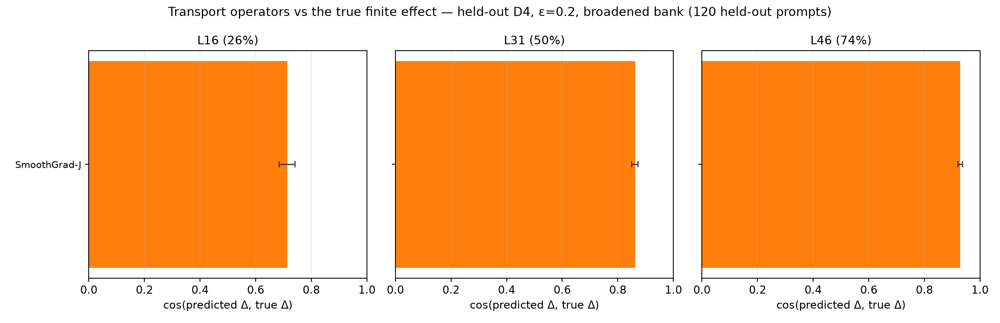
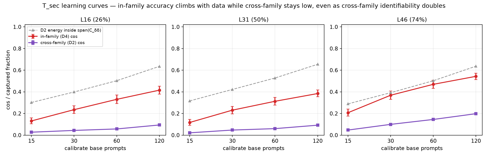
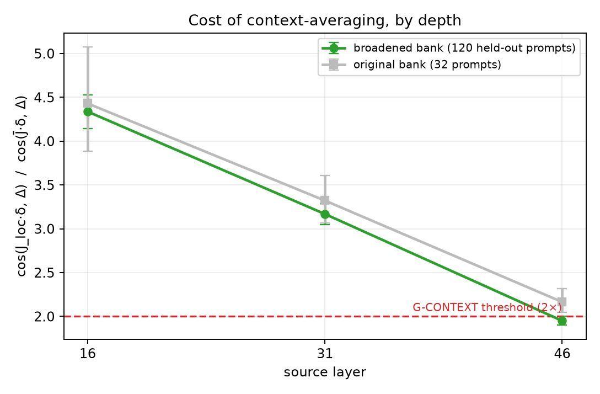
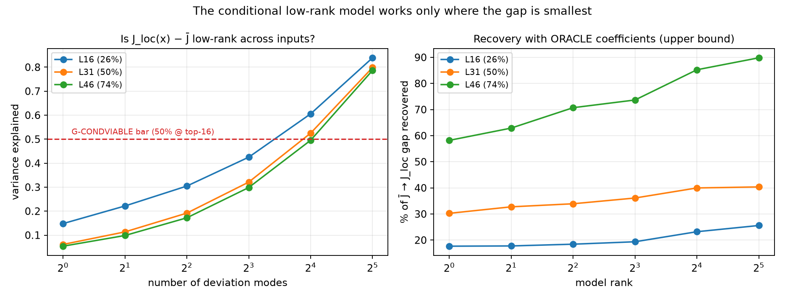
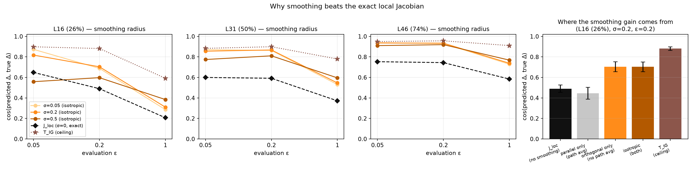

# 007 — Which operator transports an intermediate representation to the output?

**Date** 2026-08-12 · **Model** Qwen/Qwen3.6-27B (64 layers, d_model 5120) · **Status** Phase A + B
complete; Phase C routed and closed. Numbers reproducible from `research/experiments/` at the
commit recorded in each `research/outputs/*/qwen3.6-27b.json`.

---

## Question

The J-lens reads an intermediate representation by transporting it to the final layer with a single
averaged matrix, `J̄_ℓ = E[∂h_final/∂h_ℓ]`, then unembedding. The R-lens replaces the backward pass
with LRP-style stop-gradient rules. Both are *one linear operator standing in for a
context-dependent map*. This study treats them, plus four alternatives, as **competing hypotheses
about the same object**, and ranks them against a directly measured causal quantity rather than
against readability:

> for a perturbation δ applied to `h_ℓ` at one position of one prompt, which operator best predicts
> the actual downstream change `Δ = [F(h+δ) − F(h−δ)]/2` in the final residual stream?

Operators compared: `I` (logit lens), `J̄`, `R̄`, `J̄+λI`, the input-specific local Jacobian
`J_loc(x)`, a fitted secant `T_sec = C_Δδ(C_δδ+ηI)⁻¹`, its R-anchored variant
`T_RC = (C_Δδ+λR)(C_δδ+λI)⁻¹`, SmoothGrad-J, and the path-integrated `T_IG`.

**North Star.** A vocabulary-readable instrument for causally active intermediates. Cosine against
the true finite effect is the **proxy**; the validity argument is that a lens whose transport does
not predict what a perturbation actually does cannot be read causally. The proxy's known divergence
risk — a good cosine that never changes behaviour — is why the judge-free behavioural ablation (M2)
is carried as a separate, span-immune gate rather than folded into the same number.

---

## Method in one page

**Measurement is autograd-free.** `forward_from(h, ℓ)` replays blocks ℓ+1…62 on a supplied hidden
state using kwargs captured from a clean forward. Those kwargs (`position_embeddings`,
`position_ids`, `attention_mask=None`) are hidden-state-independent, so the replay is exact —
verified at `0.000e+00` max error against a full forward, re-checked at the start of every
model-side run. Every Jacobian-vector product is a central difference
`[F(h+εδ)−F(h−εδ)]/2ε`, which *is* the JVP up to O(ε²). This keeps `torch.func` and
double-backward — both untested on this GatedDeltaNet hybrid (48 of 64 blocks are
`linear_attention`) — off the critical path entirely.

**Perturbation bank.** Token-aligned minimal pairs (one template, two arguments differing in one
contiguous block) embedded in a 96-token `pile-10k` prefix, so every perturbed position sits ~104
tokens deep and stays on-distribution for operators fitted with `skip_first=4` on 128-token pile
text. Four direction families: **D4** natural activation deltas (primary), **D1** isotropic, **D2**
lens-token directions `v_t = J̄ᵀ(γ⊙u_t)`, D3 not built. Each direction measured antithetically at
ε ∈ {0.01, 0.05, 0.2, 1.0}×median‖h‖ plus native magnitude, with summed-over-current-and-future
(primary — matches the J̄/R̄ estimator) and self reductions.

| | original bank | **broadened bank (B1)** |
|---|---|---|
| base prompts | 63 | **240** |
| categories × templates | 4 × 16 | **10 × 40** |
| minimal pairs | 186 | **1,200** |
| sites (prompt × position) | 169 | **684** |
| deltas **per layer** | 7,222 | **30,096** |
| D4 / D1 / D2 | 2,490 / 4,056 / 676 | 17,100 / 10,944 / 2,052 |
| calibrate / held-out base prompts | 31 / 32 | **120 / 120** |
| D4 effective rank @ε=0.2 (λ>1e-6·λmax) | 117 | **555** |
| D4 participation ratio | 57.6 | 169.2 |
| D4+D1 fit-set effective rank | 615 | **1,911** |

Layers 16 / 31 / 46 = 26% / 50% / 74% of the target row (62). Across 3 layers the broadened bank is
**90,288 measured deltas**.

**Statistics.** Paired bootstrap, 2,000 resamples, resampling **base prompts, not deltas** — deltas
within a prompt are not independent, and resampling them would inflate n by ~250×. "CI-clear" means
the paired difference CI excludes zero. Splits are by base prompt with a fixed seed, so no template
instance appears on both sides.

---

## The identifiability confound, and why the whole study was re-run

`T_sec` is only determined on `span(C_δδ)`; ridge sends it toward zero elsewhere. With the original
bank the natural-delta family spanned **117 of 5,120 dimensions**, so a held-out direction from a
different family sat mostly *outside* the identified subspace and was mispredicted **by
construction** — a fact about the fitting set, not about transport.

This was not a hypothetical. On the original bank the study concluded the secant was dead. On the
broadened bank, with effective rank 4.7× higher:

| held-out D4, ε=0.2 | original | broadened |
|---|---|---|
| `T_sec − J̄` @ L16 | +0.075 | **+0.294** |
| `T_sec − J̄` @ L31 | +0.050 | **+0.180** |
| `T_sec − J̄` @ L46 | +0.050 | **+0.142** |

with CIs that went from overlapping J̄ to clear at every layer. **One conclusion of this study is
methodological: any transport-transfer result reported without an effective-rank and
energy-captured diagnostic is uninterpretable.** Two of the three gates would have been called
wrong on the narrow bank.

The corollary is that the gates had to be placed on quantities the confound cannot touch. Three
were: the Stein/SmoothGrad control (compares two operators on the *same* directions), in-span
transfer (evaluates only the component inside `span(C_δδ)`, with true effects freshly measured),
and behavioural ablation (never asks any operator to predict a held-out δ).



---

## Result 1 — the secant is not a transport operator (G-SECANT: FAIL)

It improves in-family with more data and does not improve on any span-immune axis.

**Stein / SmoothGrad control**, held-out D4 @ε=0.2, broadened bank:

| | L16 | L31 |
|---|---|---|
| SmoothGrad-J | **0.714** | **0.862** |
| J_loc | 0.485 | 0.590 |
| T_RC | 0.418 | 0.418 |
| T_sec | 0.408 | 0.393 |
| R̄ | 0.124 | 0.192 |
| J̄ | 0.111 | 0.188 |
| `T_sec − SmoothGrad-J` | **−0.306** [−0.367,−0.243] | **−0.469** [−0.520,−0.416] |
| `cos(T_sec·δ, SG-J·δ)` | 0.254 | 0.320 |

**In-span transfer** (held-out D1/D2 projected onto the top-r eigenvectors of `C_δδ`,
renormalised, true effects re-measured — the only transfer number the confound admits), L16, r=555:

| family | J̄ | R̄ | T_sec | `T_sec − J̄` |
|---|---|---|---|---|
| D1 | 0.161 | 0.133 | 0.042 | **−0.119** [−0.132,−0.107] |
| D2 | 0.311 | 0.250 | 0.112 | **−0.199** [−0.216,−0.184] |

Inside the subspace where it is fully identified, the fitted secant is **worse than the released
J-lens**, CI-clear, at every rank and both families — and the margin *widened* when the bank grew.

**Learning curves** settle what "worse" means. Fitting on 15 → 120 calibrate prompts:



| L31 | 15 | 30 | 60 | 120 | gain over last doubling |
|---|---|---|---|---|---|
| in-family D4 cos | .117 | .231 | .313 | .384 | +22.9% |
| cross-family D2 cos | .021 | .047 | .060 | .092 | +53.0% |
| D2 energy in span | .316 | .422 | .528 | .654 | +24.0% |
| effective rank | 325 | 636 | 1115 | 1911 | +71.4% |

**Nothing has plateaued.** The honest statement is not "the secant cannot work" but: *at 240 base
prompts it reaches 0.092 cross-family where J̄ reaches 0.311, and it is closing at ~+0.03 per
doubling of data.* Linear extrapolation in log-data puts parity with J̄ around 6 more doublings —
~64× the corpus — and that extrapolation assumes a trend that must saturate. The negative is
**a bounded, quantified negative at this data scale**, not a proof of impossibility.

**Behavioural M2** (judge-free Δ log-prob of the correct answer under ablation of each operator's
probe direction, 40 probe-swap items, identical band {16,31,46} for every operator, matched-norm
random controls):

Run twice — once with the original-bank operators, once with the **broadened-bank refits**:

| operator | Δ logp (orig ops) | Δ logp (**broad ops**) | 95% CI (broad) | top-1 kept on pile |
|---|---|---|---|---|
| **J̄** | +0.856 | **+0.856** | [+0.437, +1.354] | .977 |
| R̄ | +0.587 | +0.587 | [+0.290, +0.975] | .980 |
| logit lens | +0.022 | +0.022 | [+0.007, +0.039] | .980 |
| T_RC | +0.006 | +0.016 | [+0.001, +0.035] | .984 |
| T_sec | −0.002 | −0.006 | [−0.011, −0.000] | .988 |
| T_sec^D4 | −0.029 | −0.009 | [−0.017, −0.002] | .973 |
| matched-norm random | −0.005 | −0.005 | [−0.008, −0.001] | — |

`T_sec − J̄` = **−0.861** [−1.358, −0.445] CI-clear on the refit operators — the broadening changed
this by 0.003. Top-1 retention .97–.99 throughout, so nobody wins by breaking the model.
**This is the axis with no identifiability escape**, and the secant sits at the random-direction
noise floor on it: the only operators that identify a causal direction at all are `J̄`, `R̄`, and
(barely, +0.020 over random) `T_RC`.

*Correction to the earlier read:* on the original-bank operators `T_sec^D4 − random` was −0.025
CI-clear, i.e. worse than a random direction. On the refits that gap closes to −0.005 and is no
longer CI-clear against random. The "worse than random" finding was specific to the rank-starved
D4-only fit and does not survive; the "indistinguishable from random" finding does.

> **Verdict — G-SECANT: FAIL.** Three independent span-immune checks, all against, all CI-clear,
> and the margins did not shrink when the confound was removed. The in-family gain that survives is
> consistent with `T_sec` matching the *distribution* of natural deltas rather than transporting
> arbitrary ones.

---

## Result 2 — context-averaging is the dominant failure of the lens (G-CONTEXT: PASS 2/3)

`J_loc(x)` — the same estimator conditioned on the actual prompt and position — against the
released `J̄`, held-out D4 @ε=0.2:



| layer | J̄ | J_loc | ratio | 95% CI |
|---|---|---|---|---|
| L16 (26%) | .110 | .479 | **4.34** | [4.14, 4.53] |
| L31 (50%) | .188 | .597 | **3.17** | [3.05, 3.29] |
| L46 (74%) | .380 | .742 | **1.95** | [1.90, 2.00] |

Point estimates barely moved from the original bank while CIs tightened ~4×, so this is the
best-determined effect in the study. Averaging the Jacobian over contexts costs a factor of **2–4.3
in effect prediction**, and the cost is **monotone in depth**: largest early, decaying to ~2× by
three-quarters depth. L46 crossed from CI-clear *above* 2× on the narrow bank to CI-clear *below*
it on the broadened one — the gate reads 2 of 3, with the failing layer the deepest.

Interpretation, at *supported claim* level: the single averaged matrix is a much better
approximation late than early. That is the direction the workspace picture predicts if
representations become more context-independent as they approach the readout.

---

## Result 3 — the deviation is real but not low-rank-shared (G-CONDVIABLE: FAIL)

If `J_loc(x) − J̄` were low-rank and shared across inputs, a lens could carry a handful of
correction modes. Sketching `Y_i = J_loc(x_i)·S` on the top-192 eigenvectors of pooled `C_δδ` over
56 sites, 29 held out:



| layer | top-1 | top-4 | top-16 | top-32 | rank-16 **oracle** recovery of the J̄→J_loc gap |
|---|---|---|---|---|---|
| L16 | .148 | .305 | .606 | .839 | **23.2%** |
| L31 | .061 | .192 | .525 | .799 | **40.0%** |
| L46 | .054 | .172 | .495 | .787 | **85.2%** |

The pre-registered criterion (top-16 > 50% variance) reads 2/3 — but 0.525 and 0.495 straddle the
threshold, so the proxy is doing no work, and the direct measurement it stood in for fails.
Coefficients here are **oracle** — fitted on the held-out site's own deviation, an upper bound no
deployable model can reach. Even so, recovery is **anti-correlated with need**: it works at L46
where the gap is 1.95×, and recovers under half at L16/L31 where the gap is 3–4.3×. Rank-32 adds
+2.4 and +0.4 points over rank-16. Predicted-coefficient variants were not run: a failing oracle
bounds them.

---

## Result 4 — the largest effect in the study is smoothing, and it is *not* a path effect

SmoothGrad-J beats the **exact local Jacobian** by +0.17 to +0.27, CI-clear at every layer and
every scale ε ≤ 0.2. An
operator that beats the exact derivative at predicting a finite effect demands an explanation, and
the two candidates have opposite consequences for whether a lens can capture it:

- **H_path** — at ε=0.2 the truth is the secant from h to h+δ, not the tangent at h. Isotropic
  smoothing partially averages J along the path. This advantage is **δ-dependent: no fixed matrix
  can capture it**, and a lens is barred from it in principle.
- **H_denoise** — J(h) at the exact operating point is atypically ill-conditioned (saturated SiLU
  gates, RMSNorm geometry) and averaging over *any* small ball regularises it. This is largely
  δ-independent, so **a fitted operator could capture it**.



Three discriminators sharing one machinery, 60 sites × 300 directions × 51 held-out prompts per
layer, σ_decomp = 0.2:

| layer | ε | σ\* | J̄ | T_sec | `J_loc` σ=0 | `SG_par` ∥δ only | `SG_orth` ⊥δ only | `SG_iso` | `T_IG` | **⊥ share of gain** |
|---|---|---|---|---|---|---|---|---|---|---|
| L16 | 0.05 | 0.05 | .092 | .259 | .649 | .217 | **.823** | .818 | .899 | **103%** |
| L16 | 0.2 | 0.2 | .114 | .406 | .490 | .445 | **.705** | .704 | .882 | **101%** |
| L16 | 1.0 | 0.5 | .170 | .370 | .207 | .345 | .319 | .310 | .592 | **109%** |
| L31 | 0.05 | 0.05 | .171 | .325 | .600 | .557 | **.855** | .856 | .883 | **100%** |
| L31 | 0.2 | 0.2 | .194 | .380 | .592 | .654 | **.864** | .868 | .899 | **99%** |
| L31 | 1.0 | 0.5 | .295 | .463 | .372 | .527 | .546 | .546 | .780 | **100%** |
| L46 | 0.05 | 0.05 | .379 | .484 | .753 | .741 | **.935** | .936 | .949 | **100%** |
| L46 | 0.2 | 0.2 | .394 | .524 | .744 | .804 | **.933** | .934 | .957 | **100%** |
| L46 | 1.0 | 0.5 | .530 | .612 | .584 | .710 | .739 | .738 | .911 | **101%** |

**In 9 of 9 conditions, orthogonal-only smoothing recovers 99–109% of the isotropic gain while
doing no path averaging whatsoever.** Parallel-only smoothing — which is *nothing but* path
averaging — recovers far less, and at L16/ε=0.05 it is **catastrophically worse than no smoothing
at all** (.217 vs J_loc .649). **This is H_denoise, decisively and uniformly.**

The σ×ε grid adds a second, initially confusing fact: **σ\* tracks ε exactly** (0.05→0.05,
0.2→0.2, 1.0→0.5) at all three layers. That looks like an H_path signature, and on the 8-site
smoke it was ambiguous. With 300 directions the two facts resolve into one coherent story:
*smoothing acts as an isotropic regulariser whose optimal **strength** grows with the scale of the
effect being predicted, but whose **direction** is irrelevant.* The benefit is variance reduction
from averaging over many directions — which is why a 2-point average along a single line
(`SG_par`) does not deliver it, and why any (d−1)-dimensional average does.

So: the exact local Jacobian is a worse predictor of its own model's behaviour than a locally
averaged one, because the exact operating point is atypically ill-conditioned. Smoothing at the
matched radius closes **80–98% of the distance to the exact path integral** (L46: .934 of .957).

**Consequence for the North Star:** the largest available improvement over `J̄` is *not*
structurally barred from a lens. It is a property of where the Jacobian is evaluated, not of which
δ is applied.

### The positive control, and a bug it caught

`T_IG = δ·mean_t J(h+tδ)` must equal the true effect exactly, by the fundamental theorem of
calculus. First implementation integrated t over [0,1] and scored **0.81/0.84/0.62** — a control
that should read ~1.0. The cause was a mismatched identity, not a broken framework: ∫₀¹ gives
`Δ_one = F(h+δ)−F(h)`, while the target is the antithetic `Δ_odd = [F(h+δ)−F(h−δ)]/2`, which
equals the integral over the **symmetric** interval [−1,1]. Sampling t symmetrically:

| L31 | one-sided (wrong identity) | symmetric (correct), M=16 |
|---|---|---|
| ε=0.05 | 0.811 | **0.921** |
| ε=0.2 | 0.839 | **0.947** |
| ε=1.0 | 0.622 | **0.879** |

The residual gap is discretisation (largest at ε=1.0, where the path is longest and most curved)
plus finite-difference noise; in the full run at M=8 the ceiling reads 0.88–0.96 at ε≤0.2 and
0.59–0.91 at ε=1.0. **The framework recovers the true finite effect at ~0.95 where the path is
short, and that is the ceiling every other number competes against.** At L46/ε=0.2: T_IG .957,
SmoothGrad-J .934, J_loc .744, T_sec .524, J̄ .394.

The general lesson kept: a positive control that reads 0.84 when theory says 1.0 is not "close
enough" — it was pointing at a real mismatch between the estimand and the target, and chasing it
cost one run and bought a validated ceiling.

---

## What this does *not* establish

- **`J_own` was never computed.** `T_sec` is compared against the *released* `J̄`, which was fitted
  under its own convention (`skip_first=4`, pile-10k, n=25). A convention-matched refit is the
  controlled comparison and it was not run — cost, not principle. The ε→0 secant (`fit@0.01`) is a
  partial stand-in and is *worse* than released J̄ at L16/L31.
- **M2 cannot include `J_loc` or SmoothGrad-J.** Their probe vectors need the local Jacobian as a
  matrix (5,120 JVPs per site). So the behavioural gate ranks the *fixed* operators only, and the
  two best predictors in this study are absent from it. This is a real gap in the argument, not a
  detail: the operator that best predicts Δ has not been shown to best identify a causal direction.
- **`J̄ > R̄` on M2 here** (+0.269 [+0.073,+0.554]) is **not** a refutation of the R-lens. Different
  protocol: 40 single-token probe-swap items, Δ log-prob, 3-layer band — versus the post's 30
  multihop questions, first-half band, autorater. It means the R anchor's value is unestablished on
  *this* metric, which is why `T_RC ≈ T_sec` is unsurprising.
- **Three layers, one model, one δ-family as primary.** Depth trends rest on 3 points. Nothing here
  has been checked on a second model or a standard-attention architecture.
- **The bank's natural deltas span 555 of 5,120 dimensions.** Better than 117, still 11%. Every
  cross-family number remains identifiability-limited and is reported with its captured fraction.

---

## Where this leaves the project

The pre-registered plan routed *G-SECANT fail → Branch C2 (conditional model)*, and C2 has now
failed too. Both fitted-operator branches are closed. What replaced them is an unplanned but better
supported target: **the gain is available to a fixed operator, because it is a denoising effect
rather than a path effect.**

The natural next experiment is therefore no longer a new operator family but a direct one: fit a
lens by the released estimator **at smoothed operating points** — replace `E[∂h_final/∂h_ℓ]` with
`E_x E_u[∂h_final/∂h_ℓ |_{h+u}]` for isotropic u at σ≈0.05–0.2×median‖h‖ — and test whether the
+0.2 cosine that SmoothGrad-J shows per-input survives averaging into a single matrix. That is one
change to the fitting loop, it is measured against a ceiling we now have (`T_IG` ≈ 0.95), and
G-CONTEXT says how much of the remaining gap is context-averaging that no fixed matrix can recover
(a factor 2–4.3, largest early).

## Reproduce

```
research/experiments/A0_verify_bank.py        bank integrity (blocking)
research/experiments/B1_bank_broad.py         broadened bank
research/experiments/B2_patch_bank_bases.py   make banks self-describing + verify
research/experiments/A1_A6_fits.py            per-ε fits, J_loc/J̄        [no model]
research/experiments/A2_A5_model.py           Stein control, in-span transfer
research/experiments/A4_m2_ablation.py        behavioural M2
research/experiments/C2_conditional.py        conditional low-rank model
research/experiments/B3_learning_curve.py     learning curves            [no model]
research/experiments/B4_smoothing_mechanism.py  σ×ε grid, par/orth, T_IG
research/experiments/B5_figures.py            figures                    [no model]
```

Raw outputs (`research/outputs/`, ~4.5 GB) are gitignored and regenerable; each carries `utc`, git
hash, and its configuration.
